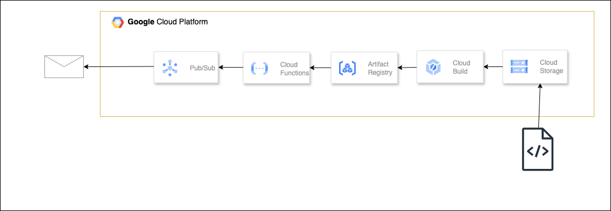

# Cloud Functionsのデプロイとメール送信の設定

<p align="center">
  
</p>


## 概要

このプロジェクトでは、Terraformを使用してCloud Functionsをデプロイし、Cloud Pub/SubとGmailのSMTPを利用してメールを送信する設定を行います。Cloud Functionsは、Cloud Storage、Cloud Build、Cloud Registryを使用してデプロイされます。

## 必要なサービス
+ Cloud Functions: 関数をデプロイして実行します。
+ Pub/Sub: メッセージングサービスを使用して、メール送信トリガーとして活用します。
+ Gmail SMTP: GmailのSMTPを使って、Cloud Functionsからメールを送信します。
+ Cloud Storage: ソースコードやリソースファイルを格納します。
+ Cloud Build: ソースコードをビルドし、アーティファクトを作成します。
+ Cloud Registry: Dockerイメージを格納するためのレジストリ。

## 起動方法

### 1. 環境ごとのtfvars作成

```
bin/make_tfvars
```

### 2. Terraform の適用

```
bin/terraform_apply
```

### 3. テスト実行
Cloud Functionsのコンソール画面から「テスト実行」ボタンを使って、Cloud Functionを手動でテストできます。この操作により、メールが正しく送信されるかを確認できます。

### 4. Terraform の削除

```
bin/terraform_destroy
```
